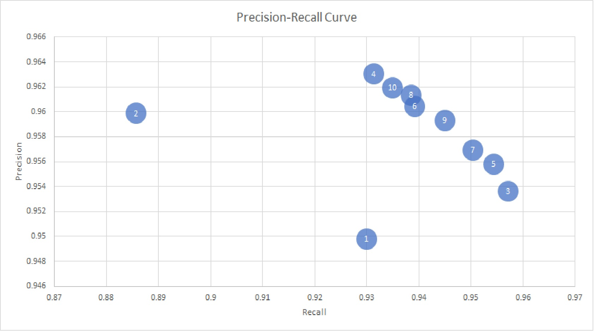

# KNN Classifier Report
## Course - Section
## Authors
Zachary Vernec, 1735394

## Distributions of Model Accuracy

Each time you run the classification model, you should be getting a different accuracy. Why? (hint: lines 148-150 in `DataSet.java`)
- The shuffling of datapoints before splitting adds some randomness.

Run the entire classification process 1000 times (load data, split into off 30% for a test set, evaluate model performance) and store the results of each run in a `double[]`; use the `mean` and `standardDeviation` methods in `kNNMain.java` to calculate how much performance can be expected to vary on unseen data
- The mean accuracy I got is 0.9687 with a standard deviation of 1.289E-4.

What is a sensible baseline against which we should compare our model's performance? (hint: line 200 in `DataSet.java`)
- The sensible baseline would be to assume that all are benign, which would give a result of 444/(237+444)=0.65%.

## Analysis of different error types

What is a false positive?
- It is when the model predicts the that the datapoint should have a positive label (e.g. malignance of tumor), yet the true label is negative (e.g. benigness of tumor).

What is a false negative?
- It is when the model predicts the that the datapoint should have a negative label, yet the true label is positive.

Extend your analysis in the previous step (with the 1000 runs) to keep track of **Recall** and **Precision** as well.
- Precision has mean 0.9564 and standard deviation 5.149E-4. 
- Recall has mean 0.9539 and standard deviation 7.451E-4.

What makes these two measures different?
- Precision keeps track of the fraction of positive predictions that were correct.
- Recall keeps track of the fraction of the positive test results are identified correctly.

What are sensible baseline for each of these measures?
- The sensible baseline for precision is to guess all are benign, which gives 309/(167+309) = 0.65.
- There is no sensible baseline for recall, as it can be made 1.00 by simply guessing all are malignant.

How do the above results change with the **hyperparameter** *k*?
- For k=3 and larger, the model seems to oscillate between having a higher recall and lower precision for odd k, and habing a lower recall but higher precision for even k. Even k=1 and k=2 fall into this pattern, although both their values are lower than for higher ks. See attached picture. 
