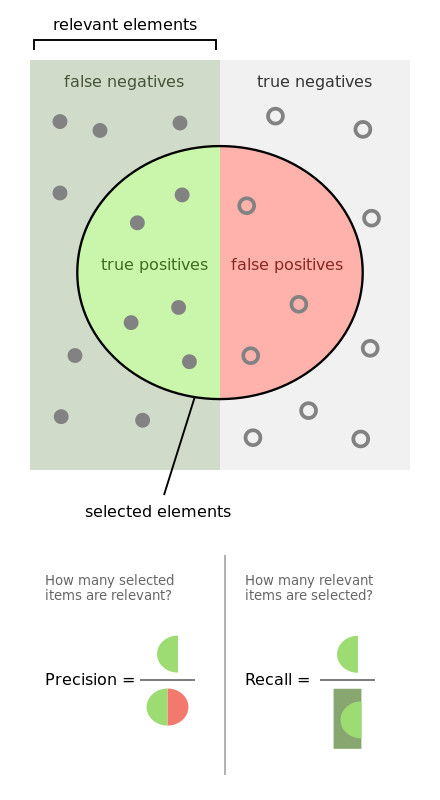

# Machine Learning
## Dawson College 360-420-DW
## Winter 2019

### Introduction to Object-Oriented-Programming for Machine Learning

- Take a close look at the following files:
	- `DataPoint.java`
	- `DataSet.java`

- Take note of the different methods in each.

- Complete Tasks 1-2 in `kNNMain.java`

- commit your changes and show your teacher.

### K-Nearest Neighbors Classification
 - Take a close look at `KNNClassifier.java`
 - what do the different methods do?

 - Complete Tasks 4, 5, and 6 in `kNNMain.java`
	- at the end of each task, **commit your changes**

## Report: Error Analysis

Now that you understand how to interact with the classes in this project, your final task is to analyse the performance of kNN classification on the `breastCancer.csv` dataset.

Most importantly, we want to characterize

 - the amount of confidence we can put in our model
	- Each time you run the classification model, you should be getting a different accuracy. Why? (hint: lines 148-150 in `DataSet.java`)
	- Run the entire classification process 1000 times (load data, split into off 30% for a test set, evaluate model performance)
	- store the results of each run in a `double[]`; use the `mean` and `standardDeviation` methods in `kNNMain.java` to calculate how much performance can be expected to vary on unseen data
		- What is a sensible baseline against which we should compare our model's performance? (hint: line 200 in `DataSet.java`)

 - the types of errors that our classifier makes
	- *Accuracy* is only one way that we can evaluate model performance. However in the context of medical diagnosis, different types of classification errors carry importances.
	- what is a
		- False Positive?
		- False Negative?

	- Extend your analysis in the previous step (with the 1000 runs) to keep track of **Recall** and **Precision** as well.
		- What makes these two measures different?
		- What are sensible baseline for each of these measures?

	- how do the above results change with the **hyperparameter** *k*?

 - Describe your results, and answer the questions above in a short report written using [Markdown](https://github.com/adam-p/markdown-here/wiki/Markdown-Cheatsheet) in the files `ErrorAnalysis.md` template file in this repo. Submit in teams of 2 max (make sure to include both names).

By <a href="//commons.wikimedia.org/wiki/User:Walber" title="User:Walber">Walber</a> - Own work, <a href="https://creativecommons.org/licenses/by-sa/4.0" title="Creative Commons Attribution-Share Alike 4.0">CC BY-SA 4.0</a>, <a href="https://commons.wikimedia.org/w/index.php?curid=36926283">Link</a>
